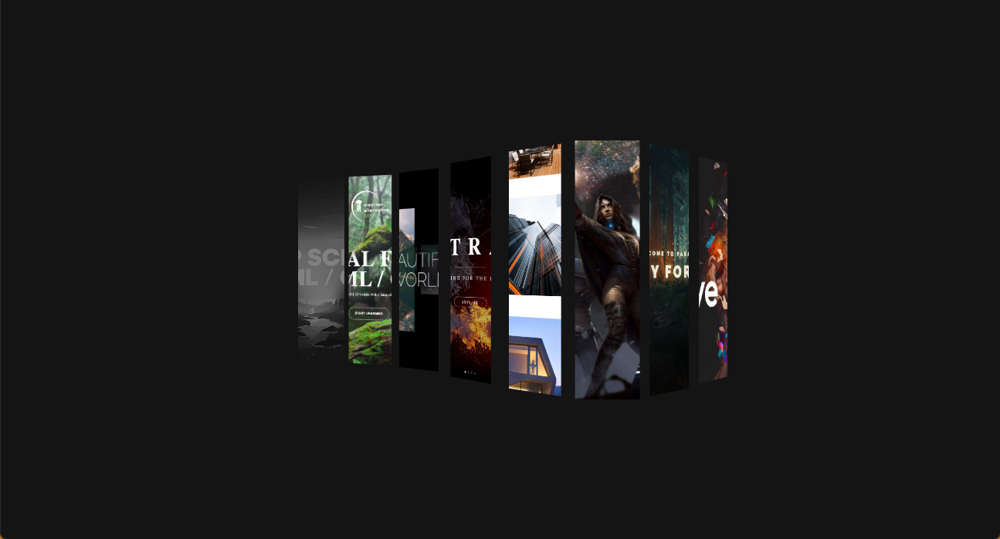
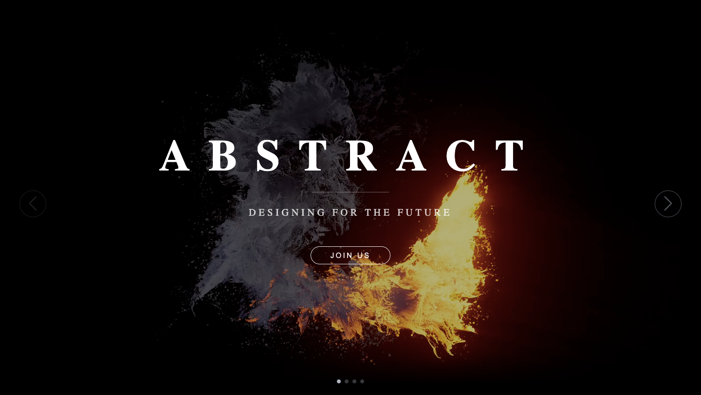
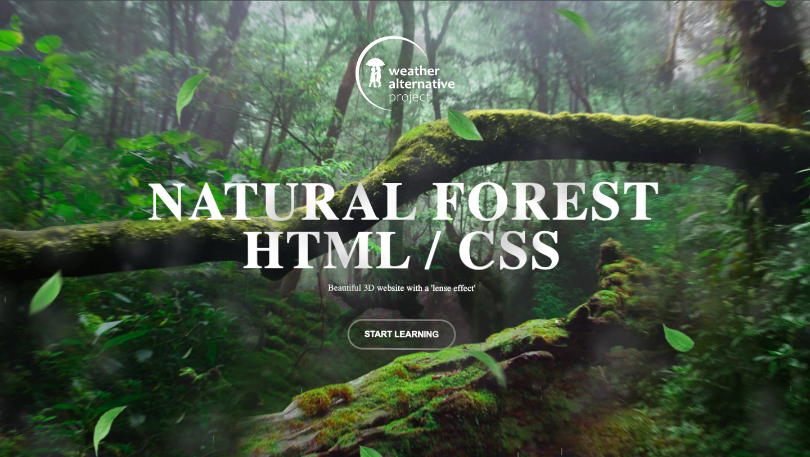
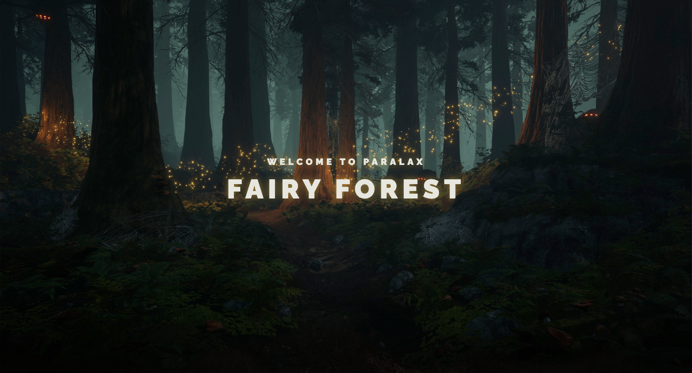
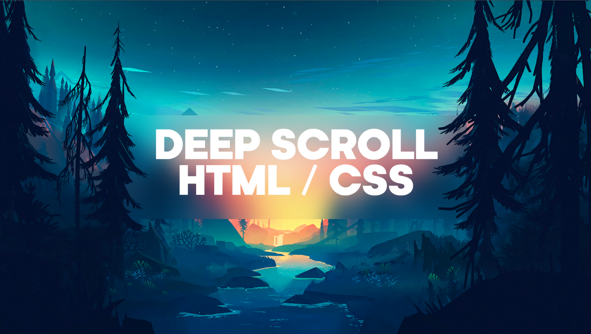
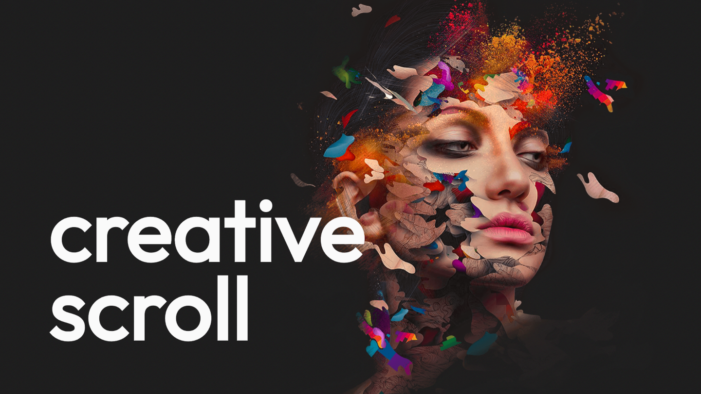
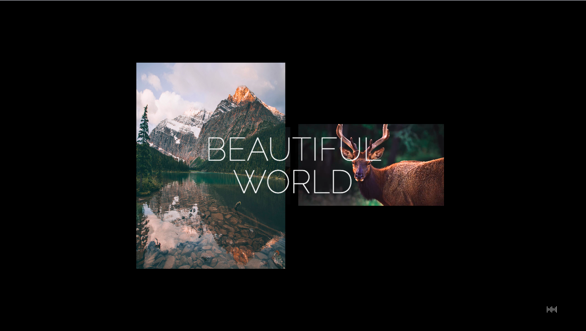
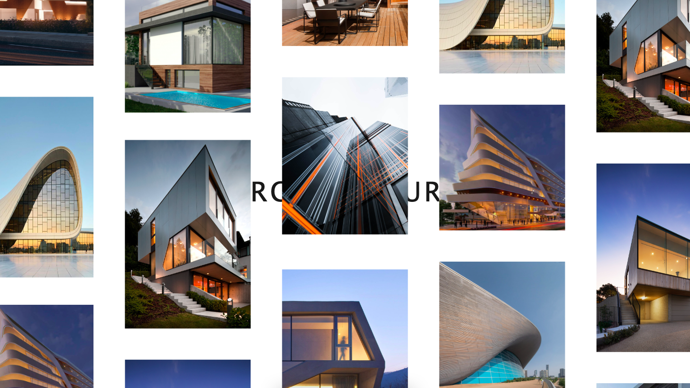
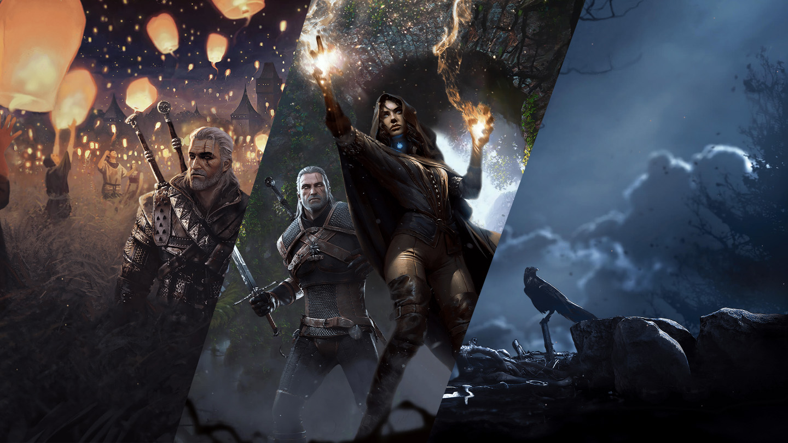

# UI-Sandbox



A collection of UI solutions, including various animation and parallax effects, using HTML, CSS, and JavaScript.

## Features

### Background Video Animation



- **Technologies**: HTML, CSS, JS
- **Libraries**: Swiper (slider), GSAP (animation)

### 3D Parallax Scene



- **Technologies**: HTML, CSS, JS

### Scroll Parallax



- **Technologies**: HTML, CSS, JS
- **Libraries**: GSAP (animation)

### Deep 3D Scroll



- **Technologies**: HTML, CSS

### Smooth Scroll



- **Technologies**: HTML, CSS, JS
- **Libraries**: GSAP (animation)

### 3D Scroll



- **Technologies**: HTML, CSS, JS

### Draggable Gallery



- **Technologies**: HTML, CSS, JS
- **Libraries**: GSAP (animation)

### Horizontal Parallax



- **Technologies**: HTML, CSS, JS
- **Libraries**: Swiper (slider)

## Installation

1. Clone the repository:

    ```sh
    git clone https://github.com/Tekeo-Ronin/UI-Sandbox.git
    ```

2. Open `index.html` in your browser to view the examples.

## Usage

Use these UI solutions to enhance your web projects with advanced animations and interactive elements.

## Contributing

Feel free to fork the repository and submit pull requests.

## License

This project is licensed under the MIT License. See the [LICENSE](./LICENSE) file for details.
